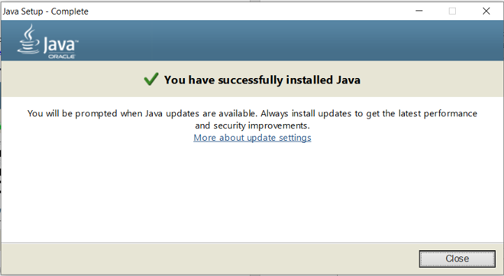

# Introduction to Dev ops
## Installation

### Pre-Requests
* [Install GIT on Windows](https://git-scm.com/download/win)

* [Install GIT on MAC](https://git-scm.com/download/mac)

* [Create GitHub Account](https://github.com/)

* [Create DockerHub Account](https://hub.docker.com/signup)

* [Install Java SDK on Windows](#How-to-Install-JDK-on-Windows)
* [Install Java SDK on MAC](#How-to-Install-JDK-on-macOS)

* [How to Install Docker on Windows](#How-to-Install-Docker-on-Windows)
* [How to Install Docker on macOS](#How-to-Install-Docker-on-macOS)
* [How to Install ngrok](#How-to-Install-ngrok-1)


This Tutorial uses MAC book to install the required tools.

### How to Install JDK on Windows

1.	Install Java on Windows machine if not installed.
https://www.java.com/en/download/win10.jsp

download the latest version JDK and double click the EXE file 

you will see the Wizard as  below 




### How to Install JDK on macOS
There are multiple ways to install JDK on MAC 

Check the Existing JDK version

` javac -version `

* Option 1: Install Directly fromJDK      
  * [Download JDK version from Oracle](https://www.oracle.com/java/technologies/javase-downloads.html)
  * Under "Java Platform, Standard Edition" ⇒ "Java SE 13.0.{x}", where {x} denotes a fast running security-update number ⇒ Click the "Oracle JDK" "Download" button.
  * Under "Java SE Development Kit 13.0.{x}" ⇒ Check "Accept License Agreement".
  * Choose the JDK for your operating platform, i.e., macOS. Download the DMG installer (e.g, jdk-13.0.{x}_osx-x64_bin.dmg - about 172MB).
  * Install JDK/JRE Double-click the downloaded Disk Image (DMG) file. Follow the screen instructions to install JDK/JRE.
  * To verify your installation, open a "Terminal" and issue this command.
  ` java -version ` 
* Option 2: Install using Brew
  * Make sure [HomeBrew](https://brew.sh/) is already installed
  * use this command to install latest jdk  `brew cask install java`
  * after complete you should able to see the JDK in `cd /Library/Java/JavaVirtualMachines/<jdk_version>/Contents/Home/`
  * add this path to your `~/.bash_profile`

  ```
  echo 'export JAVA_HOME=/Library/Java/JavaVirtualMachines/<jdk_version>/Contents/Home' >> ~/.bash_profile

  echo 'export PATH=$JAVA_HOME/bin:$PATH' >> ~/.bash_profile
  ```

### How to Install Docker on Windows

* Follow instruction on this Document: [ Install_Docker_CE_Desktop_windows.docx](Install_Docker_CE_Desktop_windows.docx)

###  How to Install Docker on macOS  
  * Download Docker for mac from (https://hub.docker.com/editions/community/docker-ce-desktop-mac/)
  * double click the .dmg file and follow the instruction

### How to Install [ngrok](https://ngrok.com/download)

Enabling Jenkins Port forwarding via ngrok, ngrok is required to enable Webhook on your Local mechine.

* Mac Users [Download](https://bin.equinox.io/c/4VmDzA7iaHb/ngrok-stable-darwin-amd64.zip)

* Windows Users [Download](https://bin.equinox.io/c/4VmDzA7iaHb/ngrok-stable-windows-amd64.zip)

Download the above zip file and run as below, the Port should be the same Jenkins 

```
win:/> ngrok.exe http 8080   

mac:$ ./ngrok http 8080   

```


## Demo Time

* [NGINX Demo](nginx_demo/)
* [JENKINS Demo](nginx_demo/)

## Useful Tips

* [Useful Docker commands](DOCKER-HINTS.md) 

